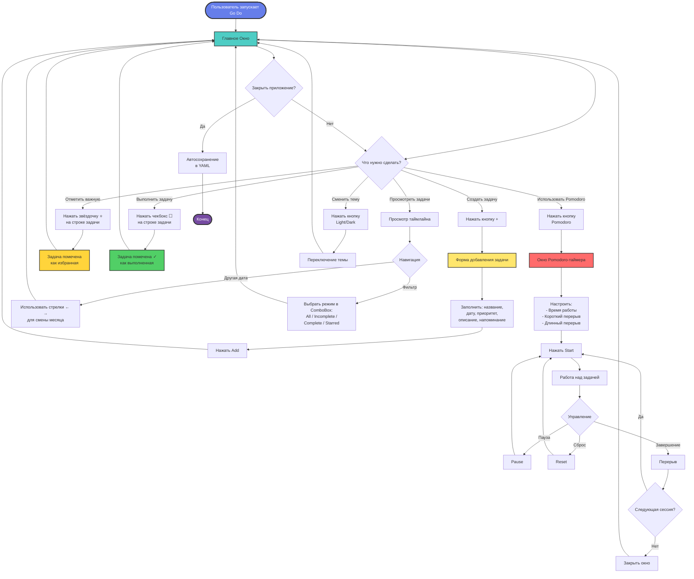

<p align="center"></p>

[](https://golang.org) [](https://fyne.io) []()

## Проблема и Решение 🎯

В современном мире хаотичное управление задачами приводит к потере фокуса, забытым дедлайнам и стрессу. Стикеры на мониторе, заметки в телефоне, задачи в голове — всё это рассеивает внимание и снижает продуктивность.

**Go Do** — это кроссплатформенное приложение для управления задачами с встроенным Pomodoro-таймером, которое превращает хаос в структуру. Организуйте задачи по приоритетам (матрица Эйзенхауэра), отслеживайте их выполнение в удобном таймлайне и концентрируйтесь на работе с техникой Pomodoro.

| До использования Go Do                              | После использования Go Do                                                                       |
| ------------------------------------------------------------------ | ----------------------------------------------------------------------------------------------------------------- |
| Задачи разбросаны по разным местам   | Все задачи в одном месте с месячной организацией                         |
| Забытые дедлайны и потерянный фокус | Приоритизация по важности/срочности и встроенный Pomodoro-таймер |
| Ручной учёт выполненных задач            | Автоматическое отслеживание с галочками и звёздочками             |

### Сравнение продуктивности ⏳

<p align="center">
  <a href="doc/Designs/godo_animation.html">
    
  </a>
</p>

**Результаты использования Go Do:**

- 📊 **В 2.6 раза** больше выполненных задач за неделю
- ⚡ **45% времени** экономится за счёт структурированного подхода
- 🎯 **85% улучшение** концентрации благодаря Pomodoro-таймеру

> **Примечание:** Это учебный проект, созданный для демонстрации навыков разработки кроссплатформенных приложений на Go с использованием Fyne.

## 🌟 Почему Go Do — ваш must-have инструмент?

* **📅 Умный Таймлайн:** Все задачи отображаются в хронологическом порядке с группировкой по датам. Быстрая навигация между месяцами с помощью стрелок!
* **⏱️ Встроенный Pomodoro-таймер:** Работайте с полной концентрацией! Настраиваемые интервалы работы (25 мин), короткого (5 мин) и длинного перерыва (15 мин). Визуальный прогресс с цветовой индикацией.
* **⭐ Избранные Задачи:** Отмечайте особо важные задачи звёздочкой для быстрого доступа.
* **✅ Отслеживание Выполнения:** Простые чекбоксы для отметки выполненных задач с визуальным подтверждением.
* **🌓 Светлая/Тёмная Темы:** Переключайтесь между режимами для комфортной работы в любое время суток. Используется стильная Gruvbox-палитра для тёмной темы.
* **📂 Месячная Организация:** Задачи автоматически сохраняются в YAML-файлы по месяцам (`data/YYYYMM.yaml`). Поддержка устаревшего TXT-формата для обратной совместимости.
* **🔍 Гибкая Фильтрация:** Просматривайте все задачи, только незавершённые, только выполненные или только избранные.

**Идеально для:** Студентов, профессионалов, всех, кто хочет структурировать свою жизнь и повысить продуктивность!

## Достижения Проекта 🏆

- **Решает Реальную Проблему:** Полноценная система управления задачами с техникой Pomodoro.
- **Учебный Проект:** Демонстрирует навыки работы с Go, Fyne, файловой персистентностью и UI/UX дизайном.
- **Кроссплатформенность:** Работает на Windows, macOS и Linux без изменений.
- **Чистая Архитектура:** Разделение на слои (Models, Persistence, UI) с использованием SOLID-принципов.

## Технические Особенности 🔧

- **Layered Architecture:** Чёткое разделение на Models, Persistence Layer и UI Layer.
- **Месячная Организация Данных:** MonthlyManager с in-memory кэшированием для производительности.
- **YAML Persistence:** Современный формат хранения с автоматической миграцией из устаревшего TXT-формата.
- **Матрица Эйзенхауэра:** 4-уровневая система приоритизации с Gruvbox-цветовой палитрой.
- **Pomodoro Integration:** Настраиваемый таймер с визуальным прогрессом и поддержкой сессий.
- **Theme System:** Поддержка светлой темы и кастомной Gruvbox Black темы.

Построено с использованием лучших практик: модульность, тестируемость, чистый код.

## Инструкции по Сборке 🛠️

### Требования

- Go 1.21+
- Fyne v2.4+
- Make (опционально, для использования Makefile)

### Сборка на Windows

```bash
# 1. Установить зависимости
go mod tidy

# 2. Собрать приложение
go build -o bin/GoDo.exe src/main.go

# Или использовать Make
make build-windows

# 3. Запустить
.\bin\GoDo.exe
```

### Сборка на Linux

```bash
# 1. Установить зависимости
sudo apt install libgl1-mesa-dev xorg-dev
go mod tidy

# 2. Собрать приложение
go build -o bin/GoDo src/main.go

# Или использовать Make
make build-linux

# 3. Запустить
./bin/GoDo
```

### Сборка на macOS

```bash
# 1. Установить зависимости
go mod tidy

# 2. Собрать приложение
go build -o bin/GoDo src/main.go

# Или использовать Make
make build-macos

# 3. Запустить
./bin/GoDo
```

### Кроссплатформенная Сборка

```bash
# Собрать для всех платформ
make build-all

# Или вручную:
# Windows
GOOS=windows GOARCH=amd64 go build -o bin/GoDo.exe src/main.go

# macOS
GOOS=darwin GOARCH=amd64 go build -o bin/GoDo-macos src/main.go

# Linux
GOOS=linux GOARCH=amd64 go build -o bin/GoDo-linux src/main.go
```

## Демонстрация Возможностей 📋

### Главное Окно (Тёмная Тема)

<p align="center"></p>

Главный экран с таймлайном задач. Цветовая индикация приоритетов (жёлтая полоса слева), чекбоксы для отметки выполнения, звёздочки для избранного, кнопки навигации по месяцам и фильтр отображения.

### Главное Окно (Светлая Тема)

<p align="center"></p>

Тот же функционал в светлой цветовой схеме. Контрастные акценты (оранжевые кнопки) для лучшей читаемости.

### Окно Добавления Задачи

<p align="center"></p>

Форма создания новой задачи: название, дата/время, местоположение, метка, тип (Event/Task), приоритет (4 уровня), описание и настройка напоминания (слайдер 0-864 минут).

### Pomodoro-таймер (Светлая Тема)

<p align="center"></p>

Круговой таймер с цветовой индикацией прогресса (градиент от красного к жёлтому к зелёному). Настройки времени работы, короткого и длинного перерывов. Кнопки управления: Start, Pause, Reset.

### Pomodoro-таймер (Тёмная Тема)

<p align="center"></p>

Тот же таймер в тёмной теме. Отображение текущего состояния (Work/Break), счётчик завершённых сессий.

## Архитектурный Дизайн 📐

Модульность для расширяемости: UI отделён от бизнес-логики. Fyne выбран для нативного GUI с поддержкой кроссплатформенности. Архитектура построена на принципах производительности и чистоты кода.

### Компоненты

#### UI Layer (`src/ui/`)

- **MainWindow** — главное окно с таймлайном задач, навигацией и фильтрами
- **TodoForm** — форма создания/редактирования задач
- **PomodoroWindow** — окно Pomodoro-таймера с настройками
- **Timeline** — виджет отображения задач с группировкой по датам
- **GruvboxTheme** — кастомная тёмная тема

#### Models (`src/models/`)

- **TodoItem** — структура задачи (Name, Content, Location, Label, TodoTime, Priority, Done, Starred, etc.)
- **ViewMode** — режимы фильтрации (All, Incomplete, Complete, Starred)
- **Priority** — система приоритетов (0-3 уровня)

#### Persistence Layer (`src/persistence/`)

- **MonthlyManager** — оркестратор операций с данными, управление in-memory кэшем
- **FileIOManager** — чтение/запись YAML и TXT файлов, атомарные операции
- **Migration** — автоматическая миграция TXT → YAML

#### Utils (`src/utils/`)

- **Localization** — поддержка мультиязычности
- **Helpers** — вспомогательные функции (форматирование дат, валидация)

### Блок-схема Пользовательского Опыта



### Блок-схема Архитектуры Классов

```mermaid
flowchart TD
    subgraph UI["UI Layer (src/ui/)"]
        MainWindow[MainWindow<br/>- Главное окно<br/>- Навигация<br/>- Фильтрация]
        TodoForm[TodoForm<br/>- Создание/редактирование<br/>- Валидация]
        PomodoroWin[PomodoroWindow<br/>- Таймер<br/>- Настройки]
        Timeline[Timeline<br/>- Отображение задач<br/>- Группировка по датам]
        Theme[GruvboxTheme<br/>- Кастомная тёмная тема]
    end

    subgraph Models["Models (src/models/)"]
        TodoItem[TodoItem<br/>- Name, Content<br/>- TodoTime, Priority<br/>- Done, Starred]
        ViewMode[ViewMode<br/>- All, Incomplete<br/>- Complete, Starred]
        Priority[Priority<br/>- Level 0-3<br/>- Color mapping]
    end

    subgraph Persistence["Persistence Layer (src/persistence/)"]
        MonthlyMgr[MonthlyManager<br/>- CRUD операции<br/>- In-memory cache<br/>- Индексация по YYYYMM]
        FileIO[FileIOManager<br/>- Read/Write YAML<br/>- Legacy TXT support<br/>- Atomic operations]
        Migration[Migration<br/>- TXT → YAML<br/>- Backward compatibility]
    end

    subgraph Utils["Utils (src/utils/)"]
        Localization[Localization<br/>- Multi-language support]
        Helpers[Helpers<br/>- Date formatting<br/>- Validation]
    end

    subgraph Storage["File Storage (data/)"]
        YAMLFiles[(YYYYMM.yaml<br/>Monthly files)]
        TXTFiles[(YYYYMM.txt<br/>Legacy format)]
    end

    MainWindow -->|Использует| Timeline
    MainWindow -->|Открывает| TodoForm
    MainWindow -->|Открывает| PomodoroWin
    MainWindow -->|Применяет| Theme
    MainWindow -->|Вызывает| MonthlyMgr

    TodoForm -->|Создаёт/редактирует| TodoItem
    TodoForm -->|Вызывает| MonthlyMgr

    Timeline -->|Отображает| TodoItem
    Timeline -->|Использует| ViewMode
    Timeline -->|Использует| Priority

    MonthlyMgr -->|Управляет| TodoItem
    MonthlyMgr -->|Использует| FileIO
    MonthlyMgr -->|Кэширует в памяти| Cache[In-Memory Cache<br/>Map: YYYYMM → []TodoItem]

    FileIO -->|Читает/пишет| YAMLFiles
    FileIO -->|Читает legacy| TXTFiles
    FileIO -->|Использует| Migration

    Migration -->|Конвертирует| TXTFiles
    Migration -->|В| YAMLFiles

    MainWindow -->|Использует| Localization
    MainWindow -->|Использует| Helpers
    TodoForm -->|Использует| Helpers

    style UI fill:#e3f2fd,stroke:#1976d2,stroke-width:2px
    style Models fill:#fff3e0,stroke:#f57c00,stroke-width:2px
    style Persistence fill:#f3e5f5,stroke:#7b1fa2,stroke-width:2px
    style Utils fill:#e8f5e9,stroke:#388e3c,stroke-width:2px
    style Storage fill:#fce4ec,stroke:#c2185b,stroke-width:2px
    style Cache fill:#fff9c4,stroke:#f9a825,stroke-width:2px
```

### Инварианты и Единицы Измерения

- **Идентификация задач:** Комбинация `TodoTime` + `Name` (без explicit ID)
- **Формат времени:** `time.Time` в UTC, парсинг через `time.Date()`
- **Формат хранения:** YAML с wrapper-структурой `{version: 1, todos: [...]}`
- **Кэш-ключи:** Строки формата "YYYYMM" (`utils.FormatDateKey()`)
- **Приоритеты:** 0-3 уровня с Gruvbox-цветами (#b8bb26, #83a598, #fe8019, #fb4934)

### Принципы Архитектуры

- **Разделение ответственности:** UI не знает о файловой системе, Persistence не знает о виджетах
- **Атомарность операций:** Все записи в файлы идут через `.tmp` → rename для предотвращения повреждений
- **Кэширование:** MonthlyManager кэширует загруженные месяцы для производительности
- **Обратная совместимость:** Поддержка чтения TXT-формата из оригинального C++ приложения

## Roadmap 📈

- [ ] Поддержка напоминаний через системные уведомления
- [ ] Экспорт задач в PDF/CSV
- [ ] Синхронизация между устройствами (облачное хранилище)
- [ ] Статистика продуктивности с графиками
- [ ] Теги и категории для задач
- [ ] Поиск по задачам
- [ ] Drag-and-drop для изменения порядка задач
- [ ] Интеграция с календарями (Google Calendar, iCal)

## Тестирование 🧪

```bash
# Запустить все тесты
go test ./tests/...

# Тесты с подробным выводом
go test -v ./tests/...

# Тесты конкретного пакета
go test ./tests/models/
go test ./tests/persistence/
go test ./tests/ui/

# Тесты с покрытием
make test-coverage
```

Тестовое покрытие включает:

- **Unit-тесты:** Models, Persistence Layer
- **Integration-тесты:** Полные CRUD-циклы, миграция форматов
- **UI-тесты:** Взаимодействие виджетов (в разработке)

## Контакт 📫

Email: neural_dog@proton.me

---

*Создано с использованием Go и Fyne — учебный проект для демонстрации навыков разработки современных кроссплатформенных приложений.*
