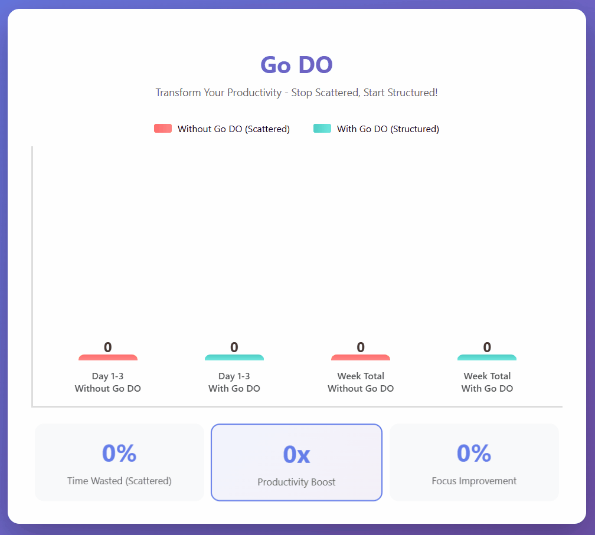
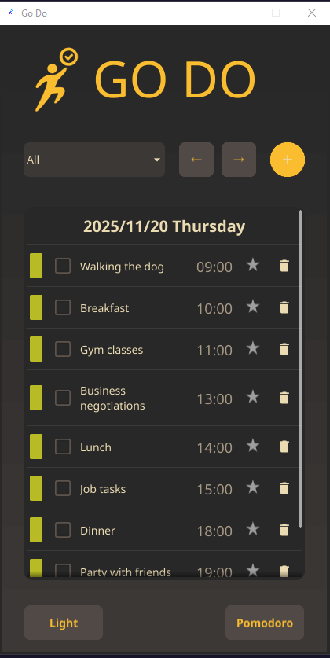
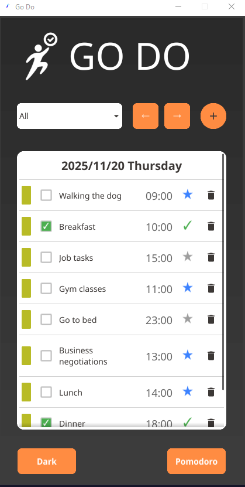
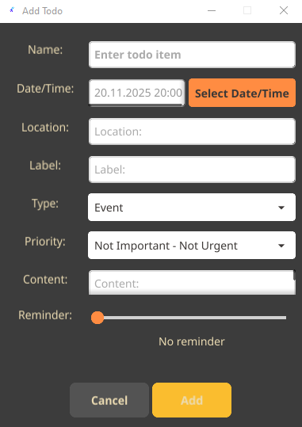
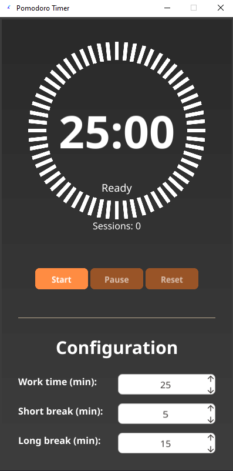
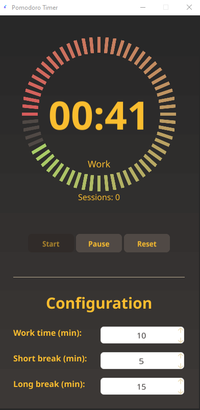
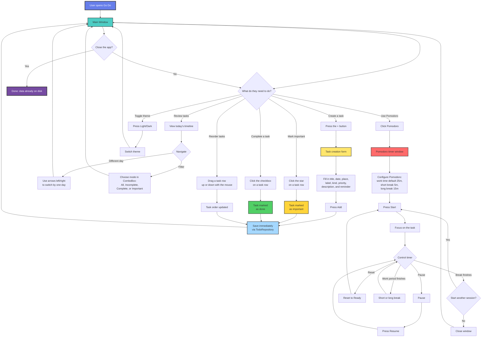

<p align="left"></p>

[](https://golang.org) [](https://fyne.io) []()

## The Problem & The Fix 🎯

In a busy day tasks live everywhere—sticky notes, phone reminders, mental checklists—and that chaos kills focus. Forgotten deadlines, scattered ideas, and constant context switching make it harder to actually get work done.

**Go Do** is a cross-platform task manager with a built-in Pomodoro timer that turns chaos into structure. Sort work by priority, track progress on a clean timeline, and stay in flow with Pomodoro sessions.

| Before Go Do                          | After Go Do                                                     |
| ------------------------------------- | --------------------------------------------------------------- |
| Tasks scattered across apps and notes | Everything in one day-focused timeline                          |
| Missed deadlines and lost focus       | Priority levels plus a built-in Pomodoro timer                  |
| Manual “done” tracking              | Clear status with checkmarks and important-task stars           |

### ⏳ Productivity Comparison



**What Go Do is designed to improve:**

- 📊 More tasks captured and completed in one timeline
- ⚡ Less context switching thanks to a day-focused workflow
- 🎯 Better focus when Pomodoro sessions are part of the routine

> **Note:** This is a learning project showcasing cross-platform app development in Go with Fyne.

## 🌟 Why Go Do Is a Must-Have

* **📅 Day-Focused Timeline:** The view shows tasks for the selected day; arrows ← → step the date by ±1 day. Per-month files are a storage detail, not the navigation unit.
* **⏱️ Built-in Pomodoro Timer:** Customize work (default 25m), short break (5m), and long break (15m) intervals, with color-coded progress.
* **⭐ Important Tasks:** Star mission-critical items for instant access.
* **✅ Done Tracking:** Lightweight checkboxes with visual confirmation so you always know what’s finished.
* **↕️ Drag Reordering:** Reorder tasks by dragging timeline rows up or down with the mouse.
* **🌓 Light/Dark Themes:** Switch anytime — the dark mode uses a Gruvbox-inspired palette (`GruvboxBlackTheme`); the light mode is the soft `LightSoftTheme`.
* **📂 Monthly Files:** Every change (add/edit/toggle/star/reorder/delete) is written immediately to per-month YAML files (`data/YYYYMM.yaml`).
* **🔍 Flexible Filters:** View everything, only active, only done, or just important/starred tasks.

**Perfect for:** Students, busy professionals, and anyone who wants a calmer, more deliberate workflow.

## Project Highlights 🏆

- **Solves a Real Pain:** A full task system with Pomodoro that keeps you on track.
- **Learning-Focused:** Demonstrates Go, Fyne, file persistence, and UI/UX craft.
- **Cross-Platform:** Runs on Windows, macOS, and Linux without tweaks.
- **Clean Architecture:** Layered structure (Models, Persistence, UI) that follows SOLID principles.

## Technical Details 🔧

- **Layered Architecture:** Clear separation between Models, Persistence Layer, and UI Layer.
- **Monthly Data Organization:** MonthlyManager with in-memory caching for speed.
- **Priority System:** Four task priority levels with a Gruvbox-inspired color palette.
- **Pomodoro Integration:** Configurable timer with visual progress and session tracking.
- **Theme System:** Switchable light and dark themes.

Built with best practices: modularity, testability, and readable code.

## Build Instructions 🛠️

### Requirements

- Go 1.19+ (per `go.mod`)
- Fyne v2.6+ (currently `v2.6.3`)
- Make (optional; the current Makefile is Windows-oriented and packages the Windows EXE by default)

### Build on Windows

```bash
# 1. Install dependencies
go mod tidy

# 2. Build the app
go build -o bin/GoDo.exe src/main.go

# Or use Make
make build-windows

# 3. Run
.\bin\GoDo.exe
```

### Build on Linux

```bash
# 1. Install dependencies
sudo apt install libgl1-mesa-dev xorg-dev
go mod tidy

# 2. Build the app
go build -o bin/GoDo src/main.go

# Or use Make
make build-linux

# 3. Run
./bin/GoDo
```

### Build on macOS

```bash
# 1. Install dependencies
go mod tidy

# 2. Build the app
go build -o bin/GoDo src/main.go

# Or use Make
make build-macos

# 3. Run
./bin/GoDo
```

### Cross-Platform Build

```bash
# Build for all platforms
make build-all

# Or manually:
# Windows
GOOS=windows GOARCH=amd64 go build -o bin/GoDo.exe src/main.go

# macOS
GOOS=darwin GOARCH=amd64 go build -o bin/GoDo-macos src/main.go

# Linux
GOOS=linux GOARCH=amd64 go build -o bin/GoDo-linux src/main.go
```

## Feature Tour 📋

### Main Window (Dark Theme)

<p align="center"></p>

The primary view with the timeline. Color coding shows priority (left accent), checkboxes mark completion, stars flag important tasks, rows can be reordered by mouse drag, arrow buttons step through days, and a filter switches views.

### Main Window (Light Theme)

<p align="center"></p>

Same layout with a bright palette. Contrast accents (orange buttons) keep everything readable.

### Add Task Window

<p align="center"></p>

Create or edit a task: title, date/time, location, label, type (Event/Task), priority (4 levels), description, and reminder slider (0-864 minutes).

### Pomodoro Timer (Light Theme)

<p align="center"></p>

Circular timer with gradient progress (red → green). Configure work time, short and long breaks. Controls: Start, Pause/Resume, Reset.

### Pomodoro Timer (Dark Theme)

<p align="center"></p>

The same timer in dark mode. Shows the current state (`Ready`, `Work`, `Short Break`, `Long Break`, or `Paused`) and counts completed sessions.

## Architectural Design 📐

Modular by design: UI is separated from business logic. Fyne provides a native-feel GUI across platforms. The structure is built for speed and clarity.

### Components

#### App Layer (`src/app/`)

- **Application** (`application.go`) — bootstrap that wires everything together: creates the `MonthlyManager` and `ConfigManager` used by `MainWindow`.
- **Paths** (`paths.go`) — `GetDataDirectory()` returns the `data/` folder *next to the executable* (not the repo root).
- **Instance** (`instance.go`) — single-instance guard backed by `utils.SingleInstance`.

#### UI Layer (`src/ui/`)

- **MainWindow** (`mainwindow.go`) — main view; depends on the `TodoRepository` / `ConfigRepository` interfaces (not concrete types). Day navigation via `onPrevDayClicked` / `onNextDayClicked` (±1 day).
- **Timeline** (`timeline.go`) — list widget that renders the tasks for the currently selected day, supports mouse drag reordering, and pulls priority color through `TodoItem.GetLevelColor()`.
- **TodoForm** (`forms/todoform.go`) — create/edit form (title, date/time, place, label, kind, priority, description) plus the custom `ReminderSlider`.
- **PomodoroWindow** (`pomodoro_window.go`) — wraps `models.PomodoroTimer` / `PomodoroConfig` / `PomodoroState`; renders progress via the `ProgressRing` widget.
- **GruvboxBlackTheme** (`dark_theme.go`) — Gruvbox-inspired dark theme.
- **LightSoftTheme** (`light_theme.go`) — soft light theme.
- **Subpackages:**
  - `widgets/` — `NumberSpinner`, `CustomSelect`, `GradientRect`, `RoundIconButton`, `SimpleRectButton`, `TinyIconButton`.
  - `helpers/` — color, layout, theme, window helpers.
  - root UI files — `constants.go` and `style_helpers.go` provide shared style constants and helper wrappers.
  - `threading/` — Fyne main-thread dispatch helpers.

#### Models (`src/models/`)

- **TodoItem** (`todo.go`) — task data: `Name`, `Content`, `Place`, `Label`, `Kind` (Event/Task), `Level` (priority 0–3), `TodoTime`, `Done`, `WarnTime` (reminder minutes), `Starred`, `Order`. Exposes `GetLevelColor()` used by the UI.
- **PriorityLevel** (`priority.go`) — typed `int` with four levels (0–3) and Gruvbox color mapping. *Not* a struct.
- **ViewMode** (`viewmode.go`) — All / Incomplete / Complete / Important (persisted internally as `starred`).
- **Sorting** (`sorting.go`) — comparators / sort helpers for ordering tasks.
- **PomodoroTimer**, **PomodoroConfig**, **PomodoroState** (`pomodoro.go`) — timer business logic and configuration.
- **Config**, **UIConfig** (`config.go`) — application configuration models persisted by `ConfigManager`.

#### Persistence Layer (`src/persistence/`)

- **TodoRepository**, **ConfigRepository** (`interfaces.go`) — abstractions the UI depends on.
- **MonthlyManager** (`monthly.go`) — implements `TodoRepository`: CRUD and in-memory cache keyed by `YYYYMM` (`utils.FormatDateKey`).
- **ConfigManager** (`config.go`) — implements `ConfigRepository`: loads/saves `config.json`.
- **FileIOManager** (`fileio.go`) — reads/writes monthly YAML files; todo writes use the shared atomic write helper.

#### Localization (`src/localization/`)

- **English string table** (`english.go`) — currently a single English map; the structure is ready to grow into a real multi-language system, but only English ships today.

#### Utils (`src/utils/`)

- **CustomDate** (`timeutils.go`) — `time.Time` wrapper with `FormatDateKey`, `ParseDateKey`, `IsLeapYear`, `DaysInMonth`, etc.
- **SingleInstance** (`singleinstance.go` + `_unix.go` / `_windows.go`) — cross-platform single-instance lock used by the App layer.

### User Journey Flow


```mermaid
flowchart TD
    Start["User opens Go Do"] --> MainWindow["Main Window"]

    MainWindow --> Action{"What do they need to do?"}

    Action -->|Create a task| ClickPlus["Press the + button"]
    ClickPlus --> AddForm["Task creation form"]
    AddForm --> FillForm["Fill in title, date, place,<br/>label, kind, priority,<br/>description, and reminder"]
    FillForm --> SaveTask["Press Add"]
    SaveTask --> SaveOnChange["Save immediately<br/>via TodoRepository"]
    SaveOnChange --> MainWindow

    Action -->|Review tasks| ViewTasks["View today's timeline"]
    ViewTasks --> Navigate{"Navigate"}
    Navigate -->|Different day| Arrows["Use arrows left/right<br/>to switch by one day"]
    Navigate -->|Filter| Filter["Choose mode in ComboBox:<br/>All, Incomplete,<br/>Complete, or Important"]
    Arrows --> MainWindow
    Filter --> MainWindow

    Action -->|Mark important| ClickStar["Click the star<br/>on a task row"]
    ClickStar --> Starred["Task marked<br/>as important"]
    Starred --> SaveOnChange

    Action -->|Complete a task| ClickCheck["Click the checkbox<br/>on a task row"]
    ClickCheck --> Completed["Task marked<br/>as done"]
    Completed --> SaveOnChange

    Action -->|Reorder tasks| DragTask["Drag a task row<br/>up or down with the mouse"]
    DragTask --> Reordered["Task order updated"]
    Reordered --> SaveOnChange

    Action -->|Use Pomodoro| ClickPomodoro["Click Pomodoro"]
    ClickPomodoro --> PomodoroWindow["Pomodoro timer window"]
    PomodoroWindow --> ConfigPomodoro["Configure Pomodoro:<br/>work time default 25m,<br/>short break 5m,<br/>long break 15m"]
    ConfigPomodoro --> StartTimer["Press Start"]
    StartTimer --> WorkSession["Focus on the task"]
    WorkSession --> TimerControls{"Control timer"}
    TimerControls -->|Pause| Pause["Pause"]
    TimerControls -->|Reset| Reset["Reset to Ready"]
    TimerControls -->|Work period finishes| Break["Short or long break"]
    TimerControls -->|Break finishes| NextSession{"Start another session?"}
    Pause --> Resume["Press Resume"]
    Resume --> TimerControls
    Reset --> StartTimer
    Break --> TimerControls
    NextSession -->|Yes| StartTimer
    NextSession -->|No| ClosePomodoro["Close window"]
    ClosePomodoro --> MainWindow

    Action -->|Toggle theme| ClickTheme["Press Light/Dark"]
    ClickTheme --> ToggleTheme["Switch theme"]
    ToggleTheme --> MainWindow

    MainWindow --> Exit{"Close the app?"}
    Exit -->|Yes| End["Done: data already on disk"]
    Exit -->|No| Action

    style Start fill:#667eea,stroke:#333,stroke-width:3px,color:#fff
    style End fill:#764ba2,stroke:#333,stroke-width:3px,color:#fff
    style MainWindow fill:#4ecdc4,stroke:#333,stroke-width:2px
    style AddForm fill:#ffe66d,stroke:#333,stroke-width:2px
    style PomodoroWindow fill:#ff6b6b,stroke:#333,stroke-width:2px
    style Completed fill:#51cf66,stroke:#333,stroke-width:2px
    style Starred fill:#ffd43b,stroke:#333,stroke-width:2px
    style SaveOnChange fill:#a5d8ff,stroke:#333,stroke-width:2px
```

> **Persistence note:** there is no autosave on exit. Each add/edit/toggle/star/reorder/delete writes through the `TodoRepository` interface immediately, so closing the app simply ends the session — the data is already on disk.

### Class Interaction Diagram


```mermaid
flowchart TD
    subgraph App["App Layer (src/app/)"]
        Application[Application<br/>- Bootstrap<br/>- Wires dependencies]
        Paths[Paths<br/>- GetDataDirectory<br/>- next to executable]
        InstanceGuard[SingleInstanceGuard<br/>- instance.go]
    end

    subgraph UI["UI Layer (src/ui/)"]
        MainWindow[MainWindow<br/>- Main view<br/>- Day navigation ±1<br/>- Filtering]
        TodoForm[TodoForm + ReminderSlider<br/>- Create/Edit<br/>- src/ui/forms/]
        PomodoroWin[PomodoroWindow<br/>- ProgressRing<br/>- timer UI]
        Timeline[Timeline<br/>- Renders selected day<br/>- Calls TodoItem.GetLevelColor]
        DarkTheme[GruvboxBlackTheme<br/>- dark_theme.go]
        LightTheme[LightSoftTheme<br/>- light_theme.go]
        Widgets[widgets/<br/>- NumberSpinner<br/>- CustomSelect<br/>- GradientRect<br/>- *IconButton]
        Helpers[helpers/<br/>- color, layout<br/>- theme, window]
        UIStyleFiles[ui root files<br/>- constants.go<br/>- style_helpers.go]
        Threading[threading/<br/>- main-thread dispatch]
    end

    subgraph Models["Models (src/models/)"]
        TodoItem[TodoItem<br/>- Name, Content, Place<br/>- Label, Kind, Level<br/>- TodoTime, WarnTime<br/>- Done, Starred, Order<br/>- GetLevelColor]
        ViewMode[ViewMode<br/>- All / Incomplete<br/>- Complete / Important<br/>- stored as starred]
        PriorityLevel[PriorityLevel<br/>- typed int 0–3<br/>- Gruvbox color map]
        Sorting[Sorting<br/>- comparators<br/>- ordering helpers]
        PomodoroTimer[PomodoroTimer<br/>+ PomodoroConfig<br/>+ PomodoroState]
        ConfigModel[Config / UIConfig<br/>- app settings model]
    end

    subgraph Persistence["Persistence Layer (src/persistence/)"]
        TodoRepo[/TodoRepository<br/>interface\/]
        ConfigRepo[/ConfigRepository<br/>interface\/]
        MonthlyMgr[MonthlyManager<br/>- impl TodoRepository<br/>- in-memory cache YYYYMM]
        ConfigMgr[ConfigManager<br/>- impl ConfigRepository]
        FileIO[FileIOManager<br/>- YAML monthly files<br/>- uses atomic helper]
        AtomicWrite[writeFileAtomic helper<br/>- .tmp → .bak → rename]
    end

    subgraph Localization["Localization (src/localization/)"]
        EnglishTable[english.go<br/>- English string table]
    end

    subgraph Utils["Utils (src/utils/)"]
        CustomDate[CustomDate<br/>- timeutils.go<br/>- FormatDateKey<br/>- DaysInMonth]
        SingleInstance[SingleInstance<br/>- cross-platform lock]
    end

    subgraph Storage["File Storage (data/ next to exe)"]
        YAMLFiles[(YYYYMM.yaml<br/>Monthly task files)]
        ConfigFile[(config.json)]
    end

    Application -->|Resolves path| Paths
    Application -->|Guards| InstanceGuard
    Application -->|Creates| MonthlyMgr
    Application -->|Creates| ConfigMgr
    Application -->|Injects MonthlyManager as TodoRepository| MainWindow
    Application -->|Injects ConfigManager as ConfigRepository| MainWindow
    InstanceGuard -->|Uses| SingleInstance
    Paths -->|Locates| Storage

    MainWindow -->|Hosts| Timeline
    MainWindow -->|Opens| TodoForm
    MainWindow -->|Opens| PomodoroWin
    MainWindow -->|Applies| DarkTheme
    MainWindow -->|Applies| LightTheme
    MainWindow -->|Depends on| TodoRepo
    MainWindow -->|Depends on| ConfigRepo
    MainWindow -->|Uses| Widgets
    MainWindow -->|Uses| Helpers
    MainWindow -->|Uses| UIStyleFiles
    MainWindow -->|Uses| Threading

    TodoForm -->|Creates/Edits| TodoItem
    TodoForm -->|Calls| TodoRepo
    TodoForm -->|Uses| Widgets

    Timeline -->|Renders| TodoItem
    Timeline -->|Filters via| ViewMode
    Timeline -->|Sorts via| Sorting
    Timeline -.->|Indirect color via TodoItem.GetLevelColor| PriorityLevel

    PomodoroWin -->|Uses| PomodoroTimer

    MonthlyMgr -.->|implements| TodoRepo
    ConfigMgr -.->|implements| ConfigRepo
    MonthlyMgr -->|Manages| TodoItem
    MonthlyMgr -->|Uses| FileIO
    MonthlyMgr -->|Cache YYYYMM → TodoItem slice| MonthlyMgr
    ConfigMgr -->|Persists| ConfigModel
    FileIO -->|Uses| AtomicWrite
    ConfigMgr -->|Uses| AtomicWrite

    FileIO -->|Reads/Writes| YAMLFiles
    ConfigMgr -->|Reads/Writes| ConfigFile

    MainWindow -->|i18n strings| EnglishTable
    TodoForm -->|i18n strings| EnglishTable

    MainWindow -->|Date helpers| CustomDate
    MonthlyMgr -->|FormatDateKey| CustomDate

    style App fill:#ede7f6,stroke:#4527a0,stroke-width:2px
    style UI fill:#e3f2fd,stroke:#1976d2,stroke-width:2px
    style Models fill:#fff3e0,stroke:#f57c00,stroke-width:2px
    style Persistence fill:#f3e5f5,stroke:#7b1fa2,stroke-width:2px
    style Localization fill:#e0f7fa,stroke:#00838f,stroke-width:2px
    style Utils fill:#e8f5e9,stroke:#388e3c,stroke-width:2px
    style Storage fill:#fce4ec,stroke:#c2185b,stroke-width:2px
```

> **Reading the diagram:** `Application` is the composition root — it resolves the data directory, guards single-instance, creates `MonthlyManager` and `ConfigManager`, and hands them to `MainWindow` *as the `TodoRepository` / `ConfigRepository` interfaces*. The UI never references concrete persistence types.

### Architecture Principles

- **Dependency inversion:** the UI depends on the `TodoRepository` / `ConfigRepository` interfaces; concrete implementations (`MonthlyManager`, `ConfigManager`) are constructed and injected by `Application` at startup.
- **Separation of concerns:** UI is decoupled from storage; persistence is decoupled from widgets; bootstrap lives in its own `app/` layer.
- **Atomic writes:** persistent writes use the shared `writeFileAtomic` helper (`.tmp → .bak → rename`) to reduce corruption risk; todo writes reach it through `FileIOManager`, while config writes call it directly from `ConfigManager`.
- **Caching:** `MonthlyManager` keeps an in-memory cache keyed by `YYYYMM` (`utils.FormatDateKey`); a month is read once and reused across views.
- **Save-on-change, not save-on-exit:** every CRUD/toggle/reorder writes through the repository immediately — no explicit autosave hook is needed.

## Development Roadmap 🧭

- **Hydration tracker:** add a small daily water tracker with a target, quick-add buttons, and lightweight progress history.
- **Main UI evolution:** expand the day view with richer task cards, better empty states, drag handles, search, and a clearer date picker for jumping across weeks/months.
- **Reminder surface:** turn `WarnTime` into visible notifications or tray alerts instead of only storing reminder metadata.
- **Pomodoro analytics:** persist timer settings, session history, focus streaks, and task-linked Pomodoro sessions.
- **Data tools:** add import/export, automatic backups, and a safe recovery view for `.bak` files.

## Testing 🧪

```bash
# Run all tests
go test ./tests/...

# Verbose output
go test -v ./tests/...

# Targeted suites
go test ./tests/models/
go test ./tests/persistence/
go test ./tests/ui/

# Coverage
make test-coverage
```

Coverage focuses on:

- **Unit:** Models, Persistence Layer
- **Integration:** CRUD cycles and persistence behavior
- **UI:** Widget interactions (in progress)

## Contact 📫

Email: neural_dog@proton.me

---

*Built with Go and Fyne — a learning project that showcases modern cross-platform development.*
